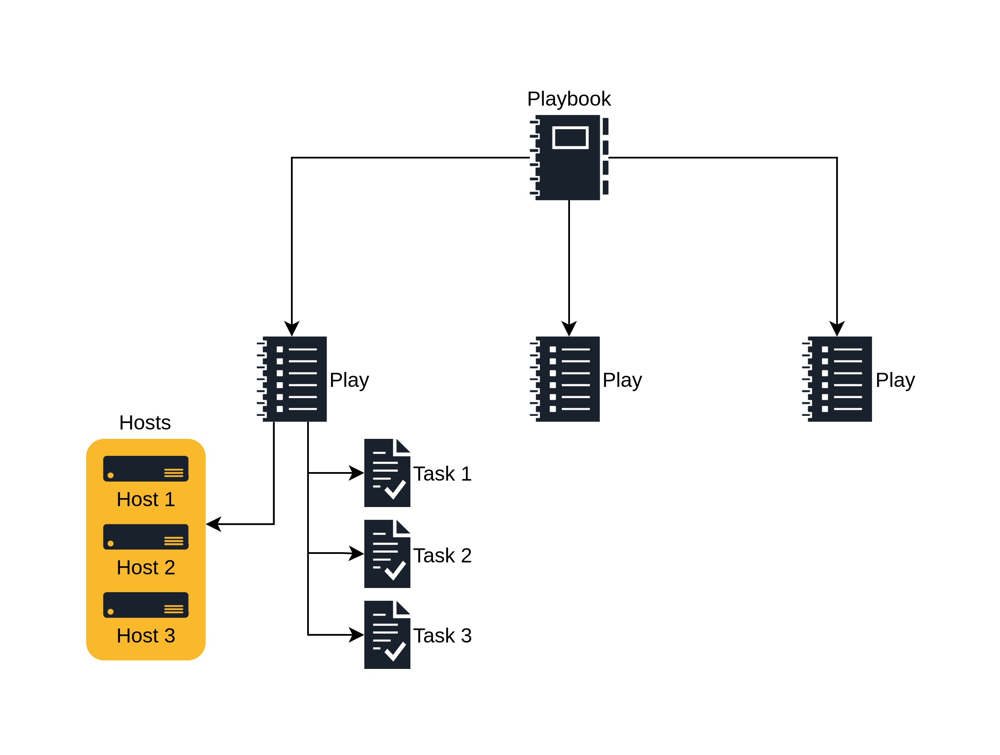

# Introduzione ai playbook

Per definire cos'è un playbook dobbiamo prima definire un play:  
I play sono sequenze ordinate di chiamate ai moduli i cui campi sono stati dichiarati,
staticamente o tramite l'uso di varibili, e in cui sono definiti uno o più gruppi di hosts.  
I playbook sono la combinazione di uno o più play nello stesso file.  

Il breakdown della gerarchia costruttiva di un playbook viene descritta come segue:  
* Il singolo _task_ descrive una singola operazione da eseguire su un gruppo di host
* Il _play_ è una sequenza ordinata di task che vengono applicati ad un gruppo di host comune
* Un _playbook_ è la combinazione di una o più _play_



## Struttura di un playbook

Il playbook è scritto nel formato yaml (YAML Ain't Markup Language), segue sempre la seguente struttura:

```yaml
---
- hosts: <nome gruppo hosts>
  tasks:
  - name: nome prima task
    <nuome modulo>:
      <opzione 1 modulo>: <valore>
      <opzione 2 modulo>: <valore>
```

Per esempio per replicare l'installazione di vim e zsh come nell'esempio da command-line si scriverebbe

```yaml
$ cat playbook.yml
---
- hosts: proxies
  tasks:
  - name: installa vim e zsh
    yum:
      name:
      - vim
      - zsh
      state: installed
```

In un singolo playbook ci possono essere più plays

```yaml
---
- hosts: webservers
  tasks:
  - name: install httpd
    yum:
      name: httpd
      state: installed
- hosts: proxies
  tasks:
  - name: install haproxy
    yum:
      name: haproxy
      state: installed
```

L'uso di più plays all'interno dello stesso playbook serve nel caso in cui si voglia operare su host group diversi o sia necessario sovrascrivere particolari impostazioni (vedi capitolo _`become`_ sotto)

I playbook vengono eseguiti tramite il comando `ansible-playbook`.

```bash
$ ansible-playbook -i inventory playbook.yml
```

[](https://asciinema.org/a/Va7O8Q5EmozVP9syWkvz7tUgi)

### Become

Ci sono situazioni in cui vogliamo sovrascrivere le impostazioni di default nell'`ansible.cfg`, sopratutto nel caso delle opzioni `become`, le quali possono essere specificate direttamente nel playbook.

```yaml
---
- hosts: webservers
  become: yes
  become_method: sudo
  become_user: root
  tasks:
    [...]
```

L'uso di queste variabili deve essere parsimonioso, in quanto sono superflue nel caso siano configurate correttamente nell'`ansible.cfg`.

### Uso di variabili

Le variabili permettono di conferire flessibilità ai playbook, permettendo, per esempio, di rendere il playbook compatibile con Centos, RHEL e Fedora.

```yaml
---
- hosts: webservers
  tasks:
  - name: create index
    copy:
      content: "Hello from {{ansible_facts['os_family']}}"
      dest: /var/www/html/index.html
```

In questo caso stiamo prendendo la variabile `ansible_os_family`
(ottenuta tramite la task `setup`, come visto in precedenza) e la stiamo iniettando dentro al file `/var/www/html/index.html`.

Le variabili possono anche essere definite all'interno del playbook:

```yaml
---
- hosts: webservers
  vars:
    webserver_port: 80
```

Ovviamente le variabili possono essere definite in più modi all'interno dello
stesso playbook, e seguono un'ordine preciso di precedenza,
che viene descritto nella [documentazione ufficiale Ansible](https://docs.ansible.com/ansible/latest/user_guide/playbooks_variables.html#variable-precedence-where-should-i-put-a-variable)

### Handlers e task condizionali

Esistono situazioni in cui vogliamo eseguire dei task solo nel caso in cui sia
soddisfatta un'altra condizione, per esempio riavviare un servizio quando il
relativo pacchetto viene aggiornato o eseguire un task in base ad un _fact_.

#### Handlers

Gli handlers sono dei task speciali che vengono eseguiti una sola volta per play,
per ultimi e solo nel caso in cui un task a cui sono associati sia terminata con lo stato `CHANGED` durante l'esecuzione.

Un esempio:

```yaml
---
- hosts: webservers
  tasks:
  - name: copy nginx config
    copy:
      src: /srv/nginx_config.conf
      dest: /etc/nginx/nginx.conf
    notify: restart nginx

handlers:
- name: restart nginx
  service:
    name: nginx
    state: restarted
```

In questo caso stiamo copiando il file di configurazione di nginx sull'host
remoto. Nel caso in cui il file destinazione venga modificato il tak passerà da
`OK` a `CHANGED`, e di conseguenza `restart nginx` verrà eseguito.  
Nel caso eseguissimo il comando una seconda volta noteremmo che il task
`restart nginx` non viene eseguito dato che non ci sono stati cambiamenti al file.

#### Task condizionali
Si possono anche utilizzare le variabili per influenzare l'esecuzione o meno di un task con l'opzione `when`

```yaml
- hosts: webservers
  tasks:
  - name: check subscriptions
    redhat_subscription:
      state: present
      auto_attach: true
    when: ansible_facts['distribution'] == 'RedHat'
```
Questo permette di creare playbook che si adeguano a host con ambienti differenti
(diverse distribuzioni, appartenenza a gruppi, presenza o assenza di caratteristiche specifiche).  
può risultare molto utile nel caso si voglia (per esempio) installare specifici
pacchetti in un gruppo di host ma solo se appartengono a una specifica distribuzione Linux (aggiunta di suscription per RHEL, patch varie al kernel, ecc. ecc.)
